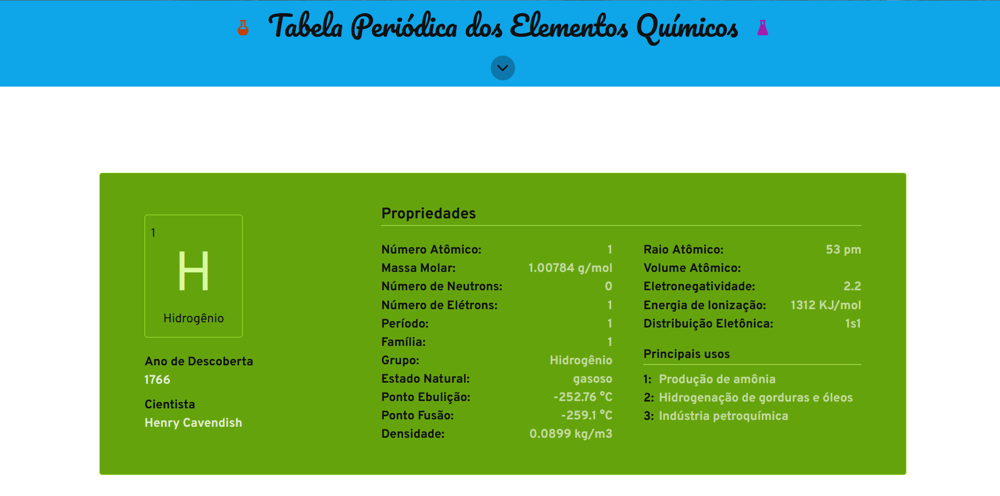
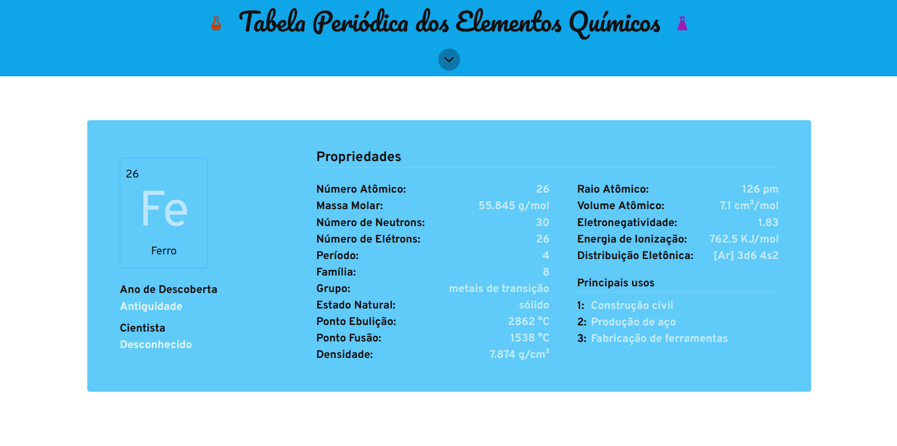
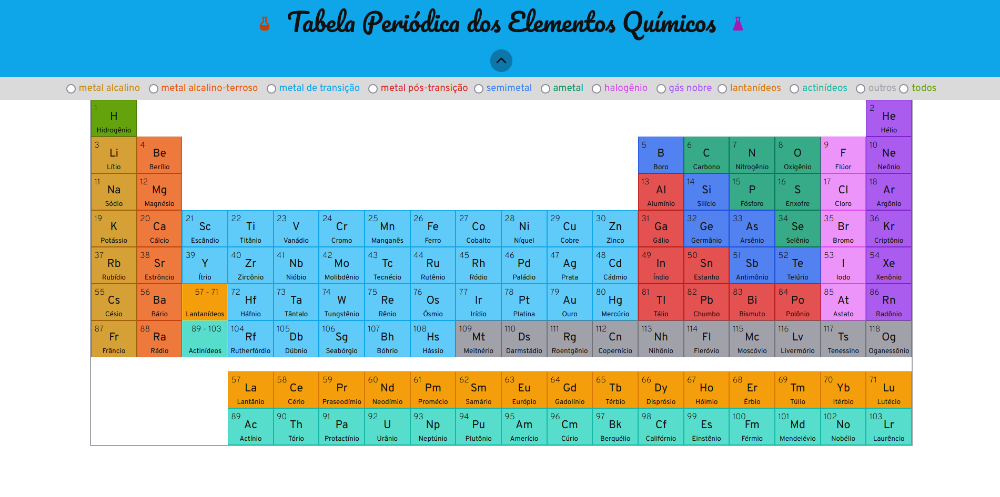
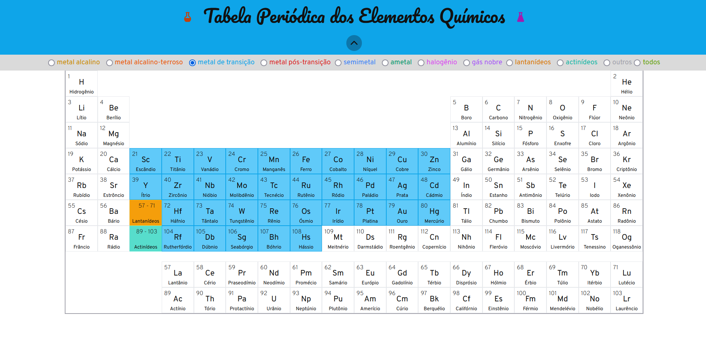
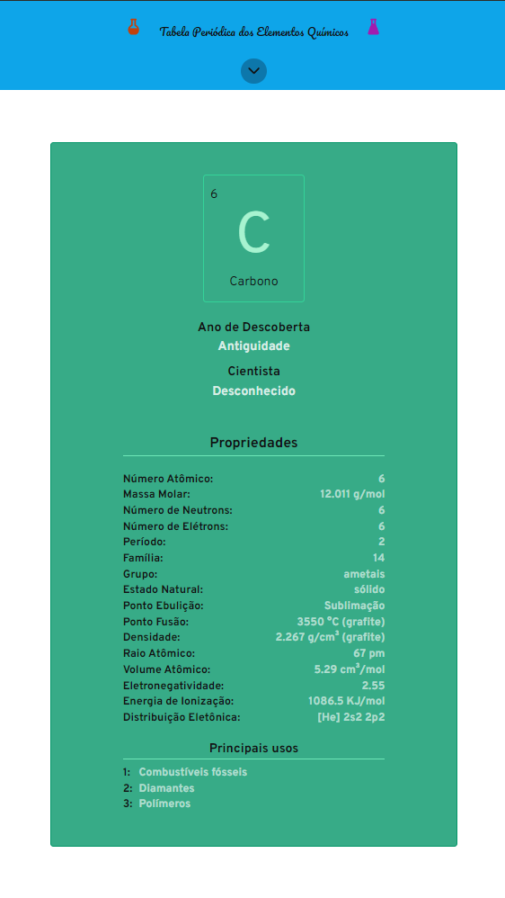
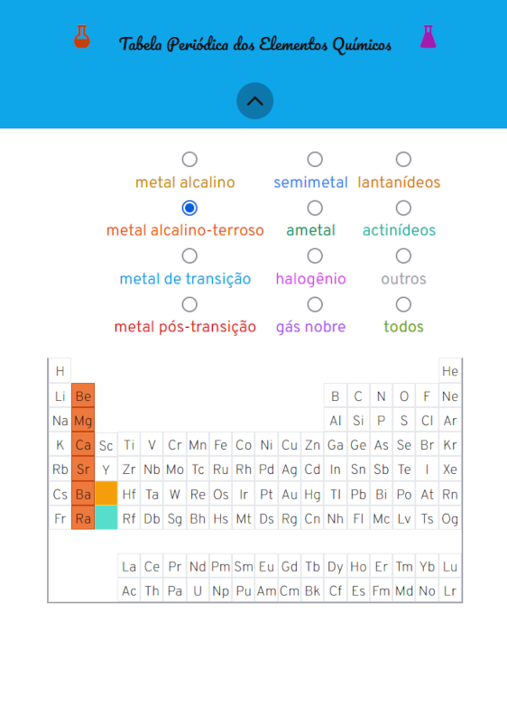

# PROJETO TABELA PERIÓDICA DOS ELEMENTOS QUÍMICOS

Projeto pessoal de uma tabela periódica. O projeto se baseia em um listagem de cards de cada elemento químico da tabela periódica. 

Os cards são diferenciados por cor de acordo com o grupo ao qual cada elemento químico pertence. 

No header da página há um botão no qual é possível abrir uma tabela periódica interativa, a qual serve como menu para acessar o card de um elemento químico específico ou filtrar os cards pelos grupos dos elementos químicos.

## Para rodar o programa

### No terminal digitar o comando
``npm run dev``

## Tecnologias utilizada no desenvolvimento do projeto

## Telas do projeto

 
Figura 1: Tela inicial

 
Figura 2: Card do grupo dos metais de transição

 
Figura 3: Menu tabela periódica

 
Figura 4: Tabela periódica com filtro dos metais de transição aplicado

 
Figura 5: Card responsivo para tela mobile

 
Figura 6: Menu tabela periódica responsivo para tela mobile

>*Projeto desenvolvido em outubro/2024*